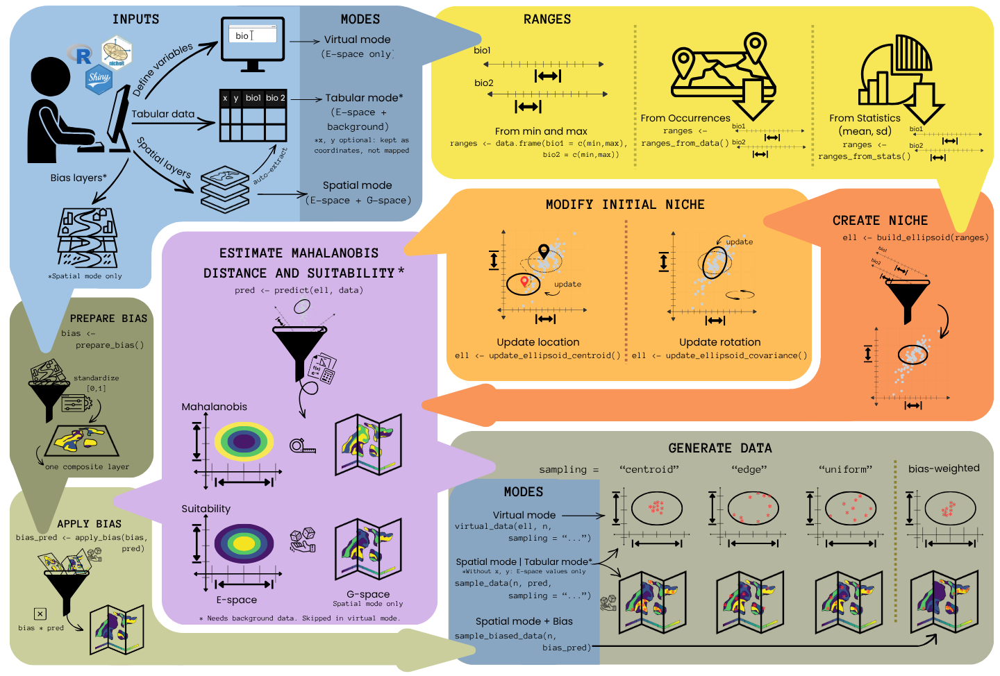

<!-- README.md is generated from README.Rmd. Please edit that file -->

<!-- badges: start -->
[](https://github.com/castanedaM/nicheR/actions/workflows/R-CMD-check.yaml)
<!-- badges: end -->

```{r, include = FALSE}
knitr::opts_chunk$set(
  collapse = TRUE,
  comment  = "#>",
  fig.path = "man/figures/",
  out.width = "100%"
)
```

## Background 

The field of distributional ecology is evolving rapidly, with new algorithms, parameterization strategies, and hypotheses emerging at a fast pace. Evaluating these ideas requires software that can isolate mechanisms, account for bias, and clearly link ecological theory to model behavior.

Virtual niche simulations help researchers test ideas by creating controlled datasets that make model behavior easier to interpret. In practice, building ellipsoid-based virtual niches in R has typically required combining several packages to define niches, map them to geography, and visualize results, making analyses harder to reproduce and build on.

**nicheR** is an R package for building and visualizing **ellipsoid-based ecological niches** using environmental data.

Inspired by the conceptual foundations of **NicheA** and the flexibility
of the **virtualspecies** package, **nicheR** provides a reproducible
framework that connects niche construction, prediction, sampling, and
visualization in one integrated workflow.


<br>

## Package description

**nicheR** defines a niche as an ellipsoid in environmental space (E-space).
When environmental data are available, the niche is predicted onto them, and
with raster layers the result is a map in geographic space (G-space). The input
data set the mode:

- **Virtual mode**: no environmental data. The variables are defined by the
  user and everything happens in E-space.
- **Tabular mode**: a table of environmental conditions is the background.
- **Spatial mode**: raster layers are the background, so results can be mapped
  and sampling bias can be added.

The figure below shows the workflow and the functions used at each step.

```{r, echo=FALSE, fig.align='center', fig.cap="Figure 1. Overview of the nicheR workflow."}

```

<br>

The ideas behind each step are explained in the
[Concepts behind nicheR](https://castanedam.github.io/nicheR/articles/concepts.html)
vignette: E-space and G-space, the three modes, the niche as an ellipsoid,
Mahalanobis distance and suitability, sampling bias, and the options for
generating data.

<br>

## Installing the package

Note: Internet connection is required to install the package.

The development version of nicheR can be installed using the code below.

```{r, eval=FALSE}

# To install the branch with the app use remote
remotes::install_github("castanedaM/nicheR", ref = "shinyApp")

# # Installing and loading packages
# if (!require("devtools")) install.packages("devtools")
# 
# # To install the package use
# devtools::install_github("castanedaM/nicheR")
# 
# # To install the package and its vignettes use (if needed use: force = TRUE)
# devtools::install_github("castanedaM/nicheR", build_vignettes = TRUE)
```

<br>

*Having problems?*

If you have any problems during installation, restart your R session,
close other RStudio sessions you may have open, and try again. If during
the installation you are asked to update packages, do so if you do not
need a specific version of one or more of the packages. If any package
gives an error when updating, install it alone using `install.packages()`,
then try installing nicheR again.

<br>

To load the package use:

```{r loading, eval=FALSE}
library(nicheR)
```

<br>

## Workflow in nicheR

A typical nicheR workflow follows the steps below. Each step has a vignette
with a complete demonstration.

| Step | Main functions | Vignette |
|------|----------------|----------|
| 1. Build an ellipsoid | `build_ellipsoid()`, `update_ellipsoid_centroid()`, `update_ellipsoid_covariance()` | [Build ellipsoid](https://castanedam.github.io/nicheR/articles/creating_ellipsoid_based_niches.html) |
| 2. Make a prediction | `predict()` | [Make a prediction](https://castanedam.github.io/nicheR/articles/predict.html) |
| 3. Add sampling bias (optional, spatial mode) | `prepare_bias()`, `apply_bias()` | [Working with bias](https://castanedam.github.io/nicheR/articles/bias.html) |
| 4. Generate data | `virtual_data()`, `sample_data()`, `sample_biased_data()` | [Generate data](https://castanedam.github.io/nicheR/articles/generating_data.html) |
| 5. Simulate communities (optional) | `random_ellipses()`, `nested_ellipses()`, `conserved_ellipses()` | [Virtual community simulation](https://castanedam.github.io/nicheR/articles/virtual_communities.html) |

Two other vignettes cover the whole workflow:

- [Plotting](https://castanedam.github.io/nicheR/articles/plotting_vignette.html)
  shows the functions for plotting niches, predictions, and data points in
  E-space: `plot_ellipsoid()`, `add_data()`, `add_ellipsoid()`, and
  `plot_ellipsoid_pairs()`.
- [Shiny app](https://castanedam.github.io/nicheR/articles/shiny_app_vignette.html)
  shows how to run the whole workflow in a graphical interface with
  `nicheR_gui()`.

<br>

## Checking the vignettes

Users can check nicheR vignettes for a full explanation of the package
functionality. The vignettes can be checked online at the
[nicheR site](https://castanedam.github.io/nicheR/) under the menu
*Articles*.

To build the vignettes when installing the package from GitHub, make sure
to use the argument `build_vignettes = TRUE`.

Check each of the vignettes with the code below:

```{r , eval=FALSE}
# Concepts behind nicheR
vignette("concepts")

# Guide to building ellipsoid-based niches
vignette("creating_ellipsoid_based_niches")

# Guide to predicting suitability and Mahalanobis distance
vignette("predict")

# Guide to preparing and applying sampling bias
vignette("bias")

# Guide to generating data from virtual niches
vignette("generating_data")

# Guide to simulating virtual communities
vignette("virtual_communities")

# Guide to visualizing ellipsoids in environmental space
vignette("plotting_vignette")

# Guide to the shiny app
vignette("shiny_app_vignette")
```

<br>

## GSoC project description

**Student:** Mariana Castaneda-Guzman

**GSoC Mentors:** Marlon E. Cobos, Vijay Barve

**Organization:** R Project for Statistical Computing

### Motivation

[nicheR](https://castanedam.github.io/nicheR/) builds ellipsoid-based virtual
ecological niches from environmental data, projects them onto a study area,
applies sampling bias, and generates virtual data points. Virtual
species are used to benchmark niche models, because they are the only setting
in which the true niche is known and model performance can be measured against
it rather than estimated.

Using the package well requires choices that are geometric and hard to
anticipate from a function signature. The range of each variable sets the
extent of the ellipsoid, the covariance between each pair of variables sets its
orientation, and the confidence level sets where its boundary falls. Those
choices interact, and their effect on the resulting niche is easiest to judge
by looking at it. In practice this means writing a script, plotting, adjusting
a number, and running it again, which is a slow way to develop an intuition and
a barrier for students and researchers who are new to niche modeling.

The goal of this project is a graphical interface to the existing nicheR
functions, so that parameter choices can be made against a plot that updates as
they are made, and so that several competing niche hypotheses can be carried
through the full workflow at once and compared side by side. The interface is
not a replacement for the package. Everything it does maps onto nicheR
functions that can be called directly, and the interface is intended as a way
to decide what those calls should be.

Two problems shaped the design. First, the workflow is sequential and stateful:
each step depends on the one before it, so editing an earlier choice has to
invalidate everything downstream rather than silently leaving stale results in
place. Second, comparing niche hypotheses requires bookkeeping that is tedious
to do by hand. The app keeps a library of ellipsoids, records where each one
came from, and stores predictions, biased surfaces, and occurrence sets
separately for each, so that changing one hypothesis never overwrites another.

### Status of the project

At the time of submission for GSoC 2026, the app implements the full nicheR
workflow across four steps.

**Inputs.** Environmental data can be supplied as rasters, as a CSV, as a saved
session, or from the bundled example data. Data can also be defined directly in
environmental space with no geographic component. Tables without coordinates
are supported and the app continues in environmental space only, matching the
package behaviour where `predict()` accepts data frames and returns data
frames.

**Build.** Ranges can be set manually, from an occurrence table, or from
published means and standard deviations, corresponding to `ranges_from_data()`
and `ranges_from_stats()`. Covariances are set with one slider per variable
pair, with limits computed so that the covariance matrix stays valid. The
centroid can be moved without changing the shape of the ellipsoid. Every saved
ellipsoid is kept in a library that records which ellipsoid each one was
derived from, and lineage is broken when the geometry changes in a way that
makes the relationship no longer meaningful.

**Predict.** One or all saved ellipsoids can be projected in a single pass,
producing suitability and Mahalanobis surfaces in truncated and untruncated
form. Results are stored per ellipsoid, and re-predicting one clears the
downstream results that depended on the old prediction.

**Bias.** Sampling effort layers are assigned directions, standardised, and
combined into a composite surface with `prepare_bias()`, then applied to a
prediction with `apply_bias()`. The step is optional and can be skipped.

**Generate.** data are drawn with `sample_data()`,
`sample_biased_data()`, or `virtual_data()`, depending on how the session
started and whether bias was applied. Data sets accumulate rather than
replace, so a series varying sample size or seed builds up in one place and can
be overlaid on the same plot.

**Plotting and export.** Every step has environmental space, geographic space,
and combined views, with figure export to PNG, PDF, or SVG at a specified size.

**Sessions.** The full state, including every ellipsoid, its lineage, and all
derived results, can be saved and reloaded.
<br>

### Remaining work

- Add community building and advanced visualization tabs.
- Add and optional variable labels for better plotting.
- Add an optional multiplier to bring variables onto a similar scale.
- Merge the shinyApp branch into main after beta testing by the coauthors

### How to access work

The full commit history for this work lives on the
[`shinyApp` branch](https://github.com/castanedaM/nicheR/commits/shinyApp/).

**Install the branch**

Vignettes are not built by default when installing from GitHub, so
`build_vignettes = TRUE` is required to get the Shiny app vignette.

```{r, eval=FALSE}
remotes::install_github("castanedaM/nicheR", ref = "shinyApp",
                        force = TRUE, build_vignettes = TRUE)
```

**View the Shiny app vignette**

```{r, eval=FALSE}
vignette("shiny_app_vignette", package = "nicheR")
```
<br>

## Note on AI usage

To maintain high standards of code quality and documentation, we have
used AI LLM tools in this package. We used these tools for grammatical
polishing and exploring technical implementation strategies for
specialized functions. We manually checked and tested all code and
documentation refined with these tools.

<br>

## Contributing

We welcome contributions to improve `nicheR`. To maintain the integrity
and performance of the package, we follow a few core principles:

- **Quality over quantity**: we prioritize well-thought-out, stable
  improvements over frequent, minor changes. Please ensure your code is
  well-documented and follows the existing style of the package.
- **Minimal dependencies**: one of the goals of nicheR is to remain
  efficient. We prefer solutions that use base R or existing dependencies.
  Proposals that introduce new package dependencies will be evaluated for
  their necessity.
- **AI-assisted code**: if you use AI tools to generate code alternatives
  or improvements, please manually verify the logic and accuracy of the
  output and demonstrate the benefit in your Pull Request.
- **Testing**: new features should include examples, and tests should be
  performed to ensure they work as intended and do not break existing
  workflows.

If you have an idea for a major change, please open an Issue first to
discuss it with the maintainers.
