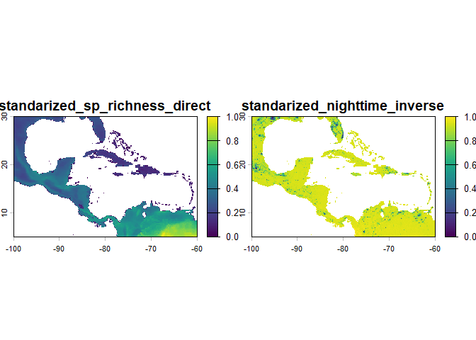
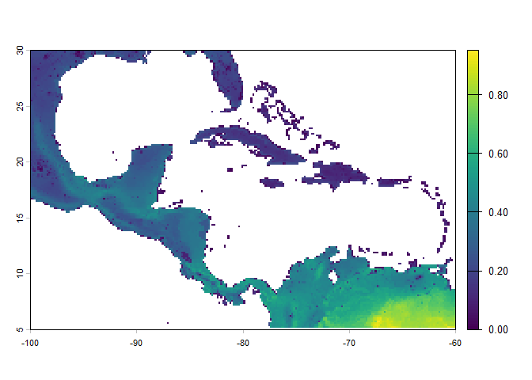
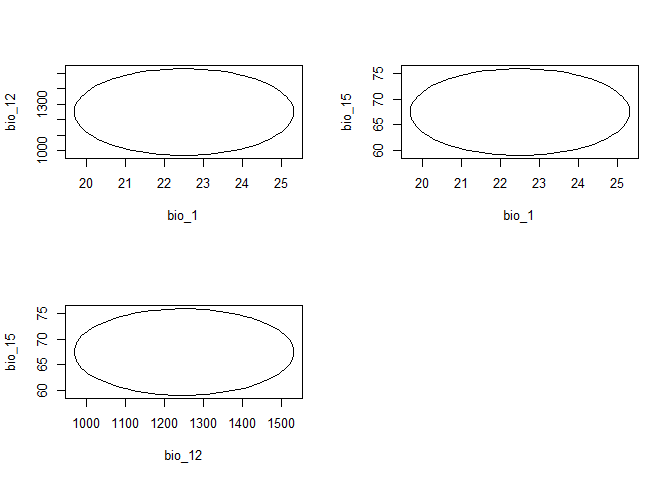
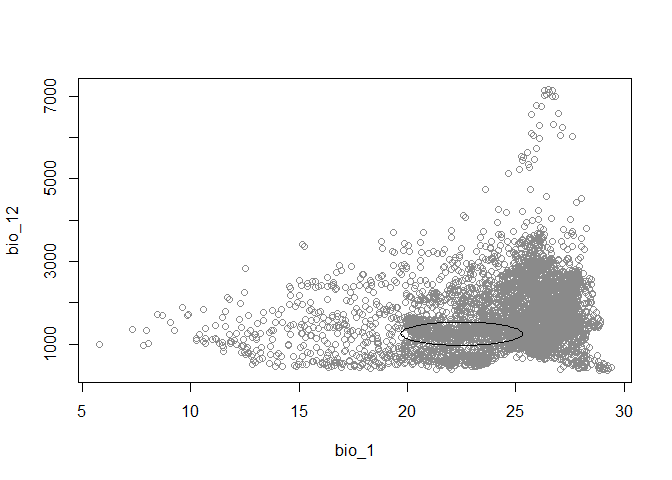
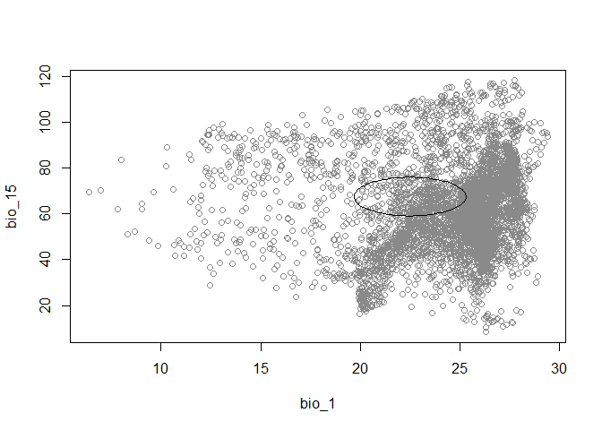
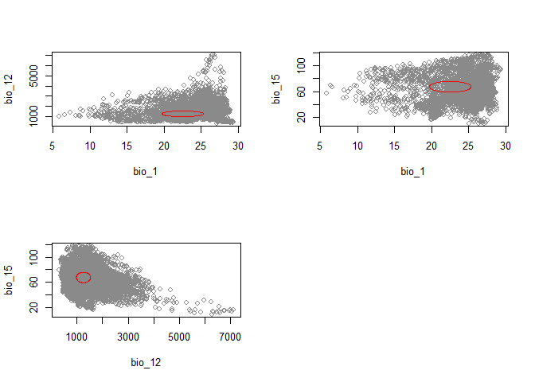
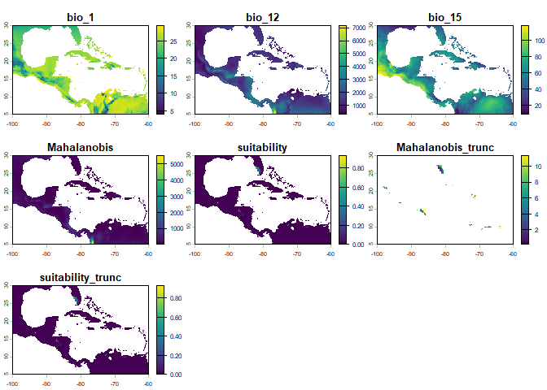
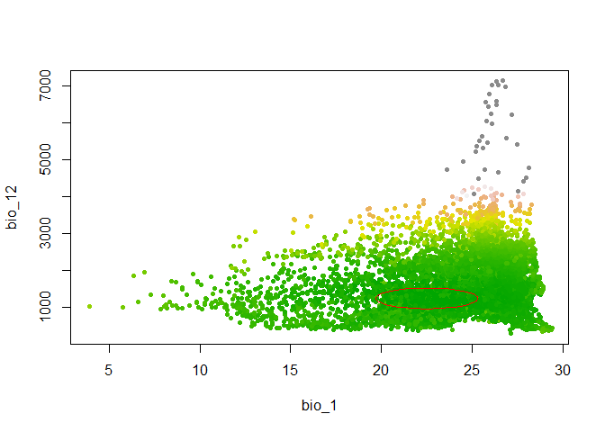
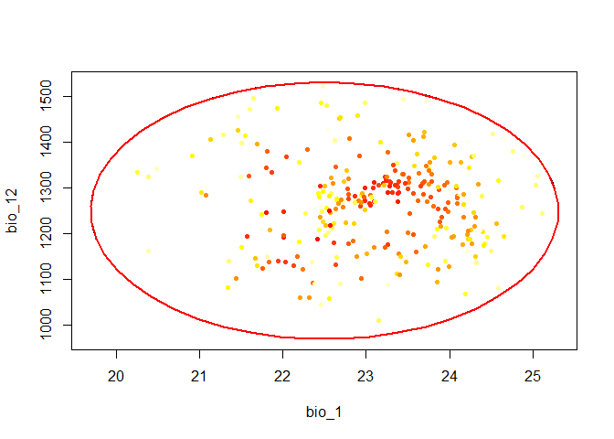
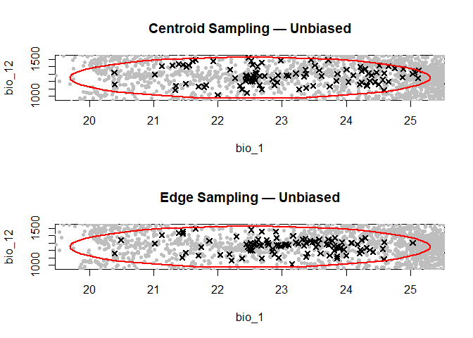

<!-- README.md is generated from README.Rmd. Please edit that file -->

<!-- badges: start -->

[](https://github.com/castanedaM/NicheR/actions/workflows/R-CMD-check.yaml)
<!-- badges: end -->

# NicheR

### Ellipsoid-Based Virtual Species and Niche Modeling in E-space and G-space

**NicheR** is an R package for building, visualizing, predicting, and
sampling **ellipsoid-based ecological niches** using environmental data.

It provides:

- Explicit ellipsoid construction in n-dimensional environmental space
- Efficient suitability detection using Mahalanobis distance
- Flexible virtual occurrence sampling strategies (center, edge, random)
- Bias surface preparation and application for realistic sampling
  simulation
- Visualization tools in environmental space (E-space) and geographic
  space (G-space)
- A unified, fully scriptable R-native workflow

Inspired by the conceptual foundations of **NicheA** and the flexibility
of the **virtualspecies** package, **NicheR** provides a reproducible
framework for virtual species simulation and niche theory exploration.

------------------------------------------------------------------------

## Authors

- Mariana Castaneda-Guzman
- Paanwaris Paansri
- Connor Hughes
- Marlon Cobos

------------------------------------------------------------------------

## Installation

Install the development version from GitHub:

``` r
if (!require("devtools")) install.packages("devtools")
#> Loading required package: devtools
#> Warning: package 'devtools' was built under R version 4.4.3
#> Loading required package: usethis
#> Warning: package 'usethis' was built under R version 4.4.3
devtools::install_github("castanedaM/nicheR")
#> Using GitHub PAT from the git credential store.
#> Skipping install of 'nicheR' from a github remote, the SHA1 (c8021377) has not changed since last install.
#>   Use `force = TRUE` to force installation
library(nicheR)
```

------------------------------------------------------------------------

## Conceptual Framework

NicheR operates across two complementary spaces:

- **E-space (Environmental Space)** Ellipsoids represent multivariate
  environmental tolerances.

- **G-space (Geographic Space)** Predictions are projected across raster
  layers to identify suitable geographic regions.

This dual-space structure allows explicit separation between niche
definition, projection, and sampling processes.

------------------------------------------------------------------------

## Workflow Overview

A typical NicheR workflow follows these steps:

1.  **Prepare environmental data** — load and subset raster layers
2.  **Prepare bias layers** (optional) — define sampling biases with
    directional effects
3.  **Build an ellipsoid** — define the niche from environmental ranges
4.  **Predict suitability** — project the ellipsoid onto raster or data
    frame inputs
5.  **Apply bias** (optional) — weight predictions by a composite bias
    surface
6.  **Sample occurrences** — draw virtual occurrence records using
    various strategies

------------------------------------------------------------------------

## Quick Example

``` r
library(nicheR)
library(terra)
#> Warning: package 'terra' was built under R version 4.4.3
#> terra 1.8.93

# Load environmental layers
bios <- terra::rast(system.file("extdata/ma_bios.tif", package = "nicheR"))
bios <- bios[[c("bio_1", "bio_12", "bio_15")]]

bios_df <- as.data.frame(bios, xy = TRUE)
```

------------------------------------------------------------------------

## Preparing Bias Layers

Bias layers represent factors that influence detectability or sampling
effort. Each layer can be applied in a `"direct"` or `"inverse"`
direction — for example, species richness increases sampling probability
(direct), while light pollution decreases it (inverse).

``` r
bias <- prepare_bias(bias_surface = terra::rast(system.file("extdata/ma_biases.tif", package = "nicheR")),
                     effect_direction = c("direct", "inverse"),
                     include_processed_layers = TRUE)
#> Starting: prepare_bias()
#> Step: splitting SpatRaster into layers...
#> Step: bias_surface is a SpatRaster. Using first layer as template surface...
#> Step: mask_na = FALSE. Expanding template to union extent (keeping finest resolution).
#> Step: standarizing (min/max) and applying direction of effect to 2 bias layer/s...
#> Step: building standarized (min/max) directional composite bias surface (mask_na = FALSE)...
#> Done: prepare_bias()

# Inspect the combination formula and composite surface
bias$combination_formula
#> [1] "sp_richness * (1-nighttime)"
bias$composite_surface
#> class       : SpatRaster 
#> size        : 150, 240, 1  (nrow, ncol, nlyr)
#> resolution  : 0.1666667, 0.1666667  (x, y)
#> extent      : -100, -60, 5, 30  (xmin, xmax, ymin, ymax)
#> coord. ref. : lon/lat WGS 84 (EPSG:4326) 
#> source(s)   : memory
#> name        : standarized_composite_bias_surface 
#> min value   :                          0.0000000 
#> max value   :                          0.9507549

# Visualize standardized layers and the composite bias surface
terra::plot(bias$processed_layers)
```



``` r
terra::plot(bias$composite_surface)
```



------------------------------------------------------------------------

## Building an Ellipsoid

Define an ellipsoid niche from environmental ranges. At minimum, provide
a data frame with two rows (min and max) for each environmental
variable.

``` r
range <- data.frame(bio_1  = c(20, 25),
                    bio_12 = c(1000, 1500),
                    bio_15 = c(60, 75))

ell <- build_ellipsoid(range = range)
#> Starting: building ellipsoidal niche from ranges...
#> Step: computing covariance matrix...
#> Step: computing additional ellipsoidal niche metrics...
#> Done: created ellipsoidal niche.

# Inspect the ellipsoid object
names(ell)
#>  [1] "dimensions"        "var_names"         "centroid"         
#>  [4] "cov_matrix"        "Sigma_inv"         "chol_Sigma"       
#>  [7] "eigen"             "cl"                "chi2_cutoff"      
#> [10] "semi_axes_lengths" "axes_coordinates"  "volume"           
#> [13] "cov_limits"
ell  # pretty print
#> nicheR Ellipsoid Object
#> -----------------------
#> Dimensions:        3D
#> Chi-square cutoff: 11.345
#> Centroid (mu):     22.5, 1250, 67.5
#> 
#> Covariance matrix:
#>        bio_1   bio_12 bio_15
#> bio_1  0.694    0.000   0.00
#> bio_12 0.000 6944.444   0.00
#> bio_15 0.000    0.000   6.25
#> 
#> Ellipsoid semi-axis lengths:
#>   280.685, 8.421, 2.807
#> 
#> Ellipsoid axis endpoints:
#>  Axis 1:
#>          bio_1   bio_12 bio_15
#> vertex_a  22.5  969.315   67.5
#> vertex_b  22.5 1530.685   67.5
#> 
#>  Axis 2:
#>          bio_1 bio_12 bio_15
#> vertex_a  22.5   1250 59.079
#> vertex_b  22.5   1250 75.921
#> 
#>  Axis 3:
#>           bio_1 bio_12 bio_15
#> vertex_a 19.693   1250   67.5
#> vertex_b 25.307   1250   67.5
#> 
#> Ellipsoid volume:  27788.51
```

### Visualizing the Ellipsoid

``` r
# Basic plots in E-space
plot_ellipsoid(ell)
plot_ellipsoid_pairs(ell)
```



``` r

# With environmental background (sampled for speed)
plot_ellipsoid(ell, background = bios_df, dim = c(1, 2), bg_sample = 5000)
```



``` r
plot_ellipsoid(ell, background = bios_df, dim = c(1, 3), bg_sample = 5000)
```



``` r

# Pairwise plot with background
plot_ellipsoid_pairs(ell, background = bios_df, bg_sample = 5000, col_ell = "red")
```



------------------------------------------------------------------------

## Predicting Suitability

Project the ellipsoid onto environmental data to obtain suitability and
Mahalanobis distance surfaces. Both truncated (inside ellipsoid only)
and non-truncated outputs are supported.

### Raster input

``` r
ell_predict_r <- predict(ell,
                         newdata = bios,
                         suitability_truncated = TRUE,
                         mahalanobis_truncated = TRUE,
                         keep_data = TRUE   # retain original bio layers in output
                         )
#> Starting: suitability prediction using newdata of class: SpatRaster...
#> Step: Using 3 predictor variables: bio_1, bio_12, bio_15
#> Done: Prediction completed successfully. Returned raster layers: bio_1, bio_12, bio_15, Mahalanobis, suitability, Mahalanobis_trunc, suitability_trunc

terra::plot(ell_predict_r)
```



### Data frame input

``` r
ell_predict_df <- predict(ell,
                          newdata = bios_df,
                          suitability_truncated = TRUE
                          )
#> Starting: suitability prediction using newdata of class: data.frame...
#> Step: Identified spatial columns: x, y
#> Step: Using 3 predictor variables: bio_1, bio_12, bio_15
#> Done: Prediction completed successfully. Returned columns: x, y, bio_1, bio_12, bio_15, Mahalanobis, suitability, suitability_trunc

head(ell_predict_df)
#>           x        y    bio_1 bio_12   bio_15 Mahalanobis  suitability
#> 1 -99.91667 29.91667 18.16097    680 39.75968    197.0208 1.649975e-43
#> 2 -99.75000 29.91667 18.06556    703 38.44158    206.5053 1.438645e-45
#> 3 -99.58333 29.91667 17.95946    725 37.43598    213.9931 3.404050e-47
#> 4 -99.41667 29.91667 18.01018    734 36.24147    223.7044 2.649735e-49
#> 5 -99.25000 29.91667 18.14458    748 34.95365    233.0873 2.430781e-51
#> 6 -99.08333 29.91667 18.36623    771 33.73626    240.0447 7.498064e-53
#>   suitability_trunc
#> 1                 0
#> 2                 0
#> 3                 0
#> 4                 0
#> 5                 0
#> 6                 0
```

### Visualizing predictions in E-space

``` r
# Non-truncated view
plot_ellipsoid(ell, background = ell_predict_df, pch = 20, bg_sample = 5000)
add_data(data = ell_predict_df, x = "bio_1", y = "bio_12",
         col_layer = "suitability",
         rev_pal   = TRUE,
         pal       = terrain.colors(100),
         bg_sample = 10000,
         pch       = 20)
add_ellipsoid(ell, col_ell = "red")
```



``` r

# Truncated view
plot_ellipsoid(ell)
add_data(data = ell_predict_df, x = "bio_1", y = "bio_12",
         col_layer = "suitability_trunc",
         rev_pal = TRUE,
         pch = 20)
add_ellipsoid(ell, col_ell = "red", lwd = 2)
```



------------------------------------------------------------------------

## Applying Bias to Predictions

Weight suitability predictions by the composite bias surface to simulate
biased sampling conditions.

``` r
biased_predict_r <- apply_bias(prepared_bias = bias,
                               prediction = ell_predict_r,
                               prediction_layer = "suitability")
#> Starting: apply_bias()
#> Step: applying bias with 'direct' effect to to "suitability" layer...
#> Done: apply_bias(). Note: values are no longer probabilities
```

------------------------------------------------------------------------

## Sampling Virtual Occurrences

NicheR supports multiple sampling strategies and methods. Sampling can
be **unbiased** (using `sample_data()`) or **biased** (using
`sample_biased_data()`).

### Unbiased sampling — raster input

``` r
sample_data_r <- sample_data(n_occ = 100,
                             prediction = ell_predict_r,
                             prediction_layer = "suitability",
                             sampling = "centroid",
                             method = "suitability",
                             strict = TRUE)
#> Starting: sample_data()
#> Done: sampled 100 points.
head(sample_data_r)
#>               x        y suitability
#> 5392  -81.41667 26.25000  0.48516011
#> 5151  -81.58333 26.41667  0.42595073
#> 6353  -81.25000 25.58333  0.26441889
#> 12975 -97.58333 20.91667  0.06460136
#> 4429  -81.91667 26.91667  0.51543338
#> 12973 -97.91667 20.91667  0.06884052
```

### Unbiased sampling — data frame, centroid strategy

``` r
sample_data_df_cn <- sample_data(n_occ = 100,
                                 prediction = ell_predict_df,
                                 prediction_layer = "suitability_trunc",
                                 sampling = "centroid",
                                 method = "mahalanobis",
                                 strict = TRUE # restrict points to inside the ellipsoid
                                 )
#> Starting: sample_data()
#> Done: sampled 100 points.

head(sample_data_df_cn)
#>               x         y    bio_1 bio_12   bio_15 Mahalanobis suitability
#> 28985 -69.25000  9.916667 23.26291   1088 61.30188   10.763926 0.004598786
#> 3464  -82.75000 27.583333 22.72719   1270 59.50328   10.363531 0.005618080
#> 23124 -86.08333 13.916667 22.98272   1486 64.65534    9.650503 0.008024537
#> 14661 -96.58333 19.750000 22.68390   1452 69.76368    6.744352 0.034314882
#> 21683 -86.25000 14.916667 23.34570   1265 59.64027   10.946360 0.004197862
#> 16251 -71.58333 18.750000 21.45765   1426 65.06884    6.970795 0.030641581
#>       suitability_trunc
#> 28985       0.004598786
#> 3464        0.005618080
#> 23124       0.008024537
#> 14661       0.034314882
#> 21683       0.004197862
#> 16251       0.030641581
```

> **Note:** Using a truncated prediction layer with `strict = TRUE`
> ensures all sampled points fall within the ellipsoid boundary.

### Unbiased sampling — edge strategy

``` r
sample_data_df_ed <- sample_data(
  n_occ            = 100,
  prediction       = ell_predict_df,
  prediction_layer = "suitability_trunc",
  sampling         = "edge",
  method           = "suitability"
)
#> Starting: sample_data()
#> Step: auto-detected a likely truncated prediction surface. Setting 'strict = TRUE' and removing NA and zero values. You can override this behavior with the 'strict' argument...
#> Done: sampled 100 points.
```

### Biased sampling — raster input

``` r
sample_data_b <- sample_biased_data(n_occ = 100,
                                    prediction = biased_predict_r,
                                    prediction_layer = "suitability_biased_direct")
#> Starting: sample_biased_data()
#> Done: sampled 100 points from biased prediction layer

head(sample_data_b)
#>               x        y suitability_biased_direct
#> 21920 -86.75000 14.75000                0.13386436
#> 22157 -87.25000 14.58333                0.10606525
#> 28756 -67.41667 10.08333                0.07180988
#> 23603 -86.25000 13.58333                0.01719372
#> 21919 -86.91667 14.75000                0.18853642
#> 4191  -81.58333 27.08333                0.01815162
```

> Even with raster input, `sample_data()` and `sample_biased_data()`
> return a data frame of occurrence records, not spatial points.

------------------------------------------------------------------------

## Visualizing Sampling Results

### Comparing centroid and edge sampling

``` r
par(mfrow = c(2, 1))

# Centroid
plot_ellipsoid(ell, main = "Centroid Sampling — Unbiased")
add_data(data = ell_predict_df, x = "bio_1", y = "bio_12",
         pts_col = "grey", pch = 20, bg_sample = 8000)
add_data(data = sample_data_df_cn, x = "bio_1", y = "bio_12",
         pts_col = "black", pch = 4, lwd = 2)
add_ellipsoid(ell, col_ell = "red", lwd = 2)

# Edge
plot_ellipsoid(ell, main = "Edge Sampling — Unbiased", pch = 20)
add_data(data = ell_predict_df, x = "bio_1", y = "bio_12",
         pts_col = "grey", pch = 20, bg_sample = 8000)
add_data(data = sample_data_df_ed, x = "bio_1", y = "bio_12",
         pts_col = "black", pch = 4, lwd = 2)
add_ellipsoid(ell, col_ell = "red", lwd = 2)
```



------------------------------------------------------------------------

## Contributing

We welcome contributions. If you have suggestions, bug reports, feature
requests, or code improvements, please open an issue or submit a pull
request on GitHub.

When contributing:

- Document functions using roxygen2
- Include minimal reproducible examples
- Add tests when appropriate

Thank you for helping improve **NicheR**.
